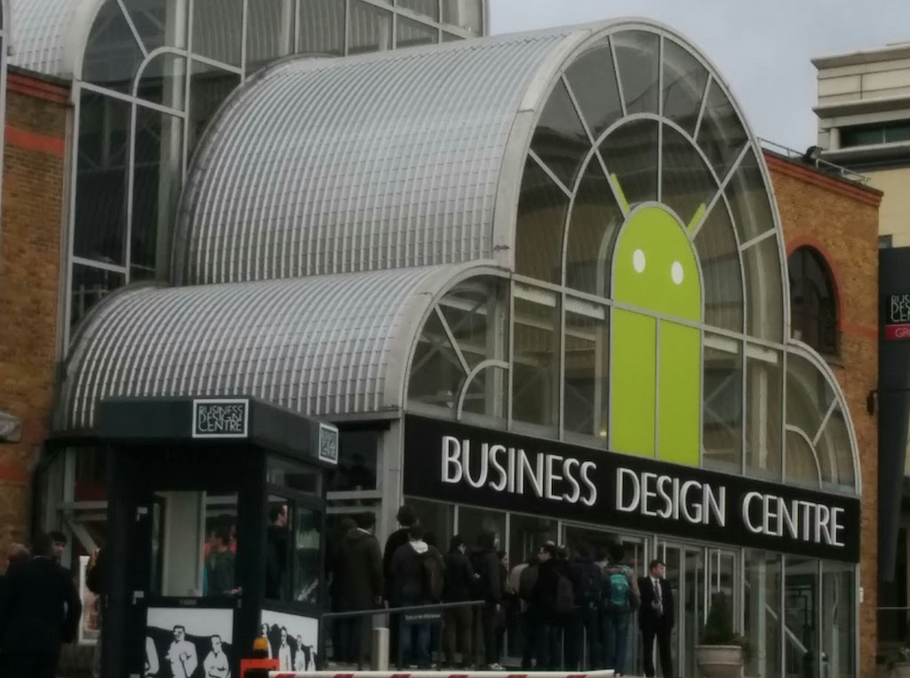

There is a long time since I haven´t written anything at this blog and yes, I feel a bit guilty for caring that less.

So probably today is a good day to make a postmortem or something similar. Let´s say "Post mortem" when 
we want to think in learnt lessons from the past and how it was useful to us.

## Overview
As a software engineer, focused on quality software is important to recycle my knowledge as soon as something new comes around. Android launches a new OS every year with new and very exciting features per se. This means to me, as a software engineer specialised on this platform, I should learn as fast as I can, to reflect as good as I can the better features of a platform which is constantly evolving and recycling itself.

## What has been useful to me for this?
I am glad, certainly the are a big amount of conferences and meetups everyone can join nowadays, and the big and amazing community of Android we have. For instance this year I went for the first time to **Google IO 2017**, an awesome event carefully crafted by **Google**. There I met with friends and new interesting people. It has been an amazing opportunity to learn new things and look up how Google creates a proper scenario for us to feel comfortable with all news.
Also this year, I had the opportunity to enjoy and participate for a first time as speaker, concretely at [Freakend Mobile 2017](https://flipper83.github.io/freakend-mobile/), an amazing conference which mixed best of both iOS and Android worlds, carefully crafted by [Jorge Barroso](https://twitter.com/flipper83) (no presentation needed). I did a short speech about 12' long, based on this topic: [From Junior to Experienced in few years](https://youtu.be/cX-1ICue0N4?list=PLKxa4AIfm4pUaVhRKxYErhAvjU9xqwZOb), as can be noticed, based on my own experience, being opinionated, and talking about past experiences, what I learnt, what I liked, what in my humble opinion could help to progress successfully in a mobile career when you start from scratch. 

Being my first talk, I can say I honestly could make it much better, but well, always there is time for beginners, don´t you think? After **Freakend**, I really felt I could do my presentations better and I had time to improve it a lot. Therefore I decided to try at the most popular meetup of Android development in London, this is called **"Londroid"**, better said, at [Londroid April](https://skillsmatter.com/legacy_profile/raul-hernandez#skillscasts). I took advantage of my first talk at Freakend Mobile to try to advance to a new more technical topic, blending both. Probably big different topics, as career advance is against image recognition with Augmented reality in Android. But I really enjoyed the second part and a friend of mine gave me a cool idea after leaving for beers when Londroid was finished, to purpose a tech talk based on the second half, thanks [David González](https://twitter.com/dggonzalez) (no presentation needed either) I really appreciate it!

## More challenges
I mentioned before, I went this year to **Google IO**, and there I took another risky decision... to apply for a new conference. Honestly, this is going to be very challenging I told to myself. I tried in **Codemotion Spain** and **Droidcon London**. A very similar topic than Londroid, but hopefully more interesting for everyone.

## What happened?
I have failed and I have got a really big surprise, I was not expecting at all to be chosen at any of those conferences. And I partially failed also at that assumption. I have got my idea chosen for **Droidcon UK**.

## Conclusions
I can feel something can be very difficult, but better to don´t create our own barrier. Now I have almost two months to prepare an interesting talk. Crossed fingers, hard work and make myself ready for people from all around Europe. Actually reading a very interesting book a friend of mine, and awesome engineer and speaker (no presentation needed really), recommended me called "Confessions of a Public Speaker" by Scott Berkun, thanks [Luis G. Valle](https://twitter.com/lgvalle). 
I am extremely thrilled about this amazing opportunity. The learning curve never stops in one way or one another, this is what I love about my profession.