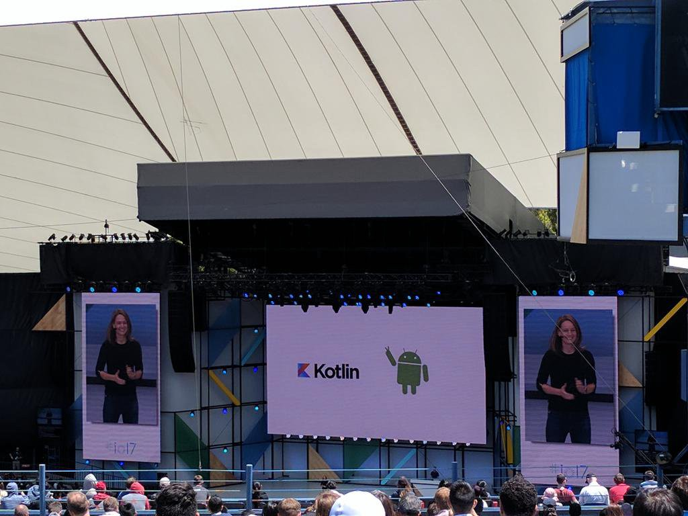
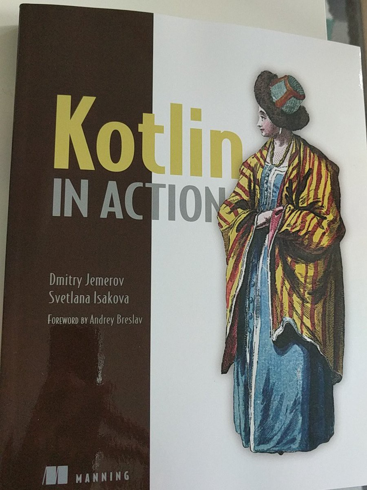
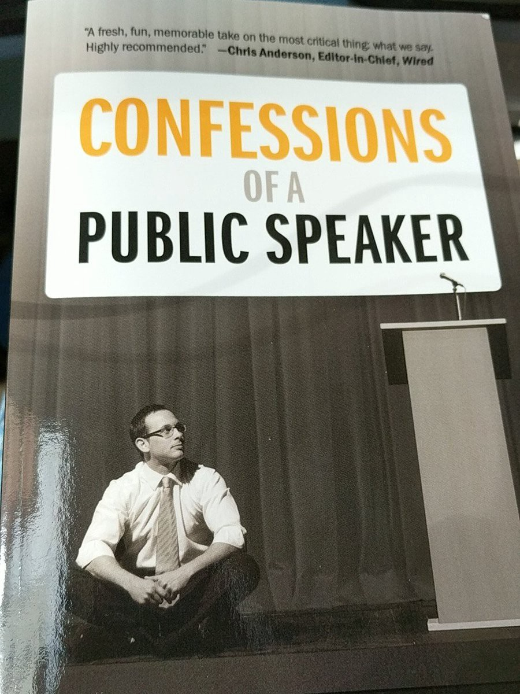
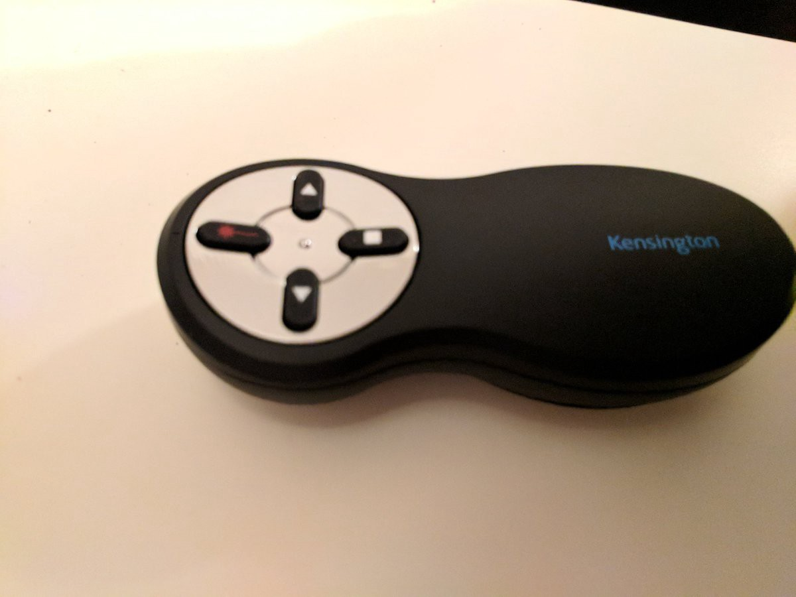
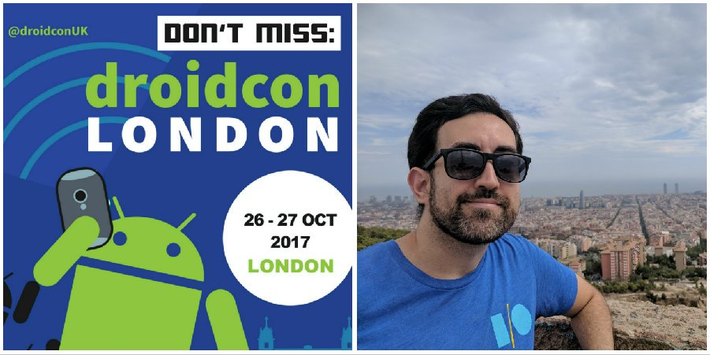
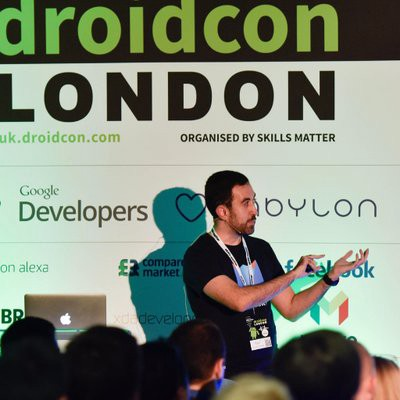

***[This same post with nicer formatting at Medium](https://medium.com/@raul.h82/2017-year-review-98dfbca6870d)***

Here we go, I promised a year ago to myself start doing yearly reviews of my personal / professional objectives, to really see how many I could accomplish over the year. This time has arrived, so first of all, I’d love to reference this same article a year ago:
[Balance of a great year post at Medium](https://medium.com/@raul.h82/balance-of-a-great-year-d7e0299ffdc6)

Starting with my ToDo list, the first objective was:

## Proof learning of Kotlin language
I must say I definitely failed this first point of the list. However, I made a huge effort to keep up to date with all that happened this year surrounding the language, for instance I went for a first time to Google I/O when this was announced!

I bought a new book about kotlin and finally I start it!
Also I’ve watched on YouTube and at conferences, as many talks regarding kotlin integration in real projects, as possible.

## Being a speaker at a great Android event
This is my biggest achievement this year 2017.
I started at a Spanish Mobile event called Freakend Mobile, a great event crafted by Jorge Barroso:
[From junior to experienced in few years at Freakend Mobile 2017 video](https://youtu.be/cX-1ICue0N4),
This talk wasn’t really a technical one (sorry it’s in Spanish BTW), it was more about career progression, and how I made it during my Android adventure, coming from another technology / language.
Then, I tried to do a combination between this first talk and a new technical topic to see different opinions and receiving valuable feedback. This talk was at Londroid May 2017, the most popular meetup in London about Android:
[Quest of a hero](https://skillsmatter.com/skillscasts/10128-quest-of-a-hero)

I received good feedback in general, however it was confusing for some people the connection between both topics. Thanks to David González to give me the push I needed to extend the second part of it. This gave me extra energy to push the limits of the technical part I needed.
After some delivering I proposed a new longer topic to a couple of conferences, as mentioned at [Post mortem post](./2017-8-26-Post-Mortem)

By August, I knew I was going to be a speaker, and now I can tell this experience couldn’t be more positive.
 link to the Tweet:
[My talk announced at Droidcon UK 2017](https://twitter.com/RaulHernandezL/status/901197907138883584)

Earlier the conference, Skills Matters provided an awesome course given by Jenny Martin to new speakers, for improving public speaking. My kudos to her for being so good at teaching us, and thank you so much to all members of the course, they gave lots of support to each other.
In the meantime, I was finishing reading another book called “Confessions of a public speaker”, thanks for the tip [Luis G. Valle](https://twitter.com/lgvalle)! It helped a lot! After reading this book I knew everyone is human and can be nervous, made mistakes during presentations, and we are not a cyborg giving speeches.

Remember this:
*“speakers are also humans”*

I got fairly prepared for my talk, I trained about 10 times (thanks to my girlfriend Cristina for helping me! and my colleagues of TouchSurgery for their patience during my work presentation), as well as I bought a laser pointer which I love, it does a great job, because it helps to take care about the important things: the presentation.

Wait! I got advised by a friend that I was at the Sneak Preview of DroidCon UK, and I really couldn’t believe it (more pressure on me! noooo xD)

[#DroidconUK SNEAK PREVIEW: #Android star @RaulHernandezL on #AugmentedReality & the opportunities #DroidCon brings!](https://twitter.com/skillsmatter/status/922466011290460167)

Talking about DroidCon UK, I must tell it was amazing, I really enjoyed attending many talks, meeting amazing speakers, and also speakers like me, a first time speaking at DroidCon. I really enjoyed giving my talk, despite I was truly nervous at the beginning of my talk. However, for a beginner isn’t that bad, isn’t? Remember, speakers are also humans :)

To the ones interested in watching the video, don’t waste your time and go straight to it! (kidding, please, keep reading first!)
[Building a Minimum Viable Product (MVP) with Face Recognition and AR in Android](https://skillsmatter.com/skillscasts/10786-building-a-minimum-viable-product-mvp-with-face-recognition-and-ar-in-android)

After watching my talk several times, and receiving the official feedback from DroidCon London, as well as asking for feedback from friends, colleagues and people I know, I am happy with the final result, mostly all people enjoyed it, and there is space for improvement. I really think I´d improve it further more for a next time. But I’ve learnt tons during this time, both soft and technical skills, simply by preparing this topic, so I´d recommend to anyone to try at least once for a long public talk.

I can tell I love machine learning, and this was a fantastic moment to invest some time refreshing things, learning new things and giving a try to deep learning. I really enjoyed it, and I certainly will play further when I can.

Finishing my ToDo list, the last but not the least important of my objectives:
# Run another half a marathon some day
Well, looking to “some day”, I can’t say I failed it, right?! :)

To be honest with you all, I was very close to join a half a marathon earlier my talk for DroidCon UK. However when it was announced the fact that I was going to be one of the speakers… a Sunday night I was about to subscribe me for the half a marathon of Valencia (precisely the same month than DroidCon UK), and a late Monday when a Londroid was finishing, I received an email telling me the good news!

I was pretty sure the email was going to tell me there were lots of interesting talks and mine was not chosen, but I got extremely surprised by this.

As you can notice, this is the best excuse I can tell you for my latest objective.

To prepare a competition, both physically or mentally demanding, this requires tons of investment to finish it in a good shape. So I decided to prepare my talk as good as possible. After the final result I am so happy with my decision.

Mentioning another sentence I introduced which is not part of the ToDo list:
***try being publicly exposed by writing more both non-technical and technical online content***
I can’t say I wrote a lot, but I wrote a couple of non-technical posts this year, as well as I exposed myself publicly by means of public speaking. After all the effort I pushed for it, I can confess this worth it. I spent uncountable hours polishing my github repo for the slides at the presentation:
[Sample for the presentation at github](https://github.com/raulh82vlc/Image-Detection-Samples)

Trying to make it readable, to make sense on my slides to others. Learning about face recognition and neural networks. Indeed I was thinking in publishing some technical articles about my lessons learnt when doing my presentation, but after such a busy end of the year, I honestly needed some rest.

I consider this latest point extremely important, we need to know when to start saving energy, keep working on ongoing tasks and be ready for new adventures. Over the years I’ve learnt to know my limits and when to say to stop, and after DroidCon this time arrived for me.

# TODO list
- Proof learning of Kotlin language (again! but this time for real)
- Keep progressing on my career
- Try to learn more about deep learning
- Attending amazing events
- Having a bit more of life balance
- Run another half a marathon some day (I hope my personal and professional life give me extra time for it!)

This time, I want to keep “public speaking” apart from the list until I find something interesting to tell.
All I can share with you is here, I will review this same post next year to expose myself and my points!

Please, if you like it, please clap and share it!